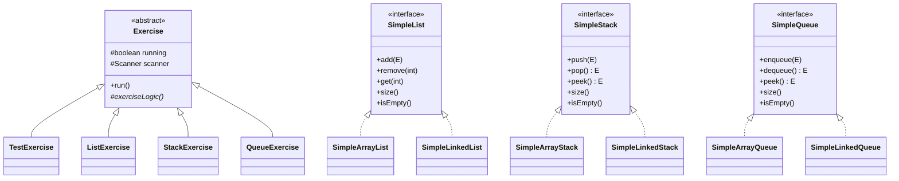

[guia_explicacion_tps.md](https://github.com/user-attachments/files/26946906/guia_explicacion_tps.md)
# Guía Completa — TPs de Programación II

## Estructura general del proyecto

```
Parcial_1_Grupo_06/
└── src/
    ├── application/          ← TP01: Base del programa
    │   ├── MainProgram.java
    │   ├── Exercise.java
    │   └── TestExercise.java
    ├── listModule/           ← TP02 y TP03: Listas
    │   ├── SimpleList.java        (interfaz)
    │   ├── SimpleArrayList.java   (implementación con array)
    │   ├── SimpleLinkedList.java  (implementación con nodos)
    │   └── ListExercise.java      (ejercicio interactivo)
    ├── stackModule/          ← TP04: Pilas
    │   ├── SimpleStack.java       (interfaz)
    │   ├── SimpleArrayStack.java  (implementación con array)
    │   ├── SimpleLinkedStack.java (implementación con nodos)
    │   └── StackExercise.java     (ejercicio interactivo)
    └── queueModule/          ← TP04: Colas
        ├── SimpleQueue.java       (interfaz)
        ├── SimpleArrayQueue.java  (implementación con array)
        ├── SimpleLinkedQueue.java (implementación con nodos)
        └── QueueExercise.java     (ejercicio interactivo)
```

---

## TP01 — Fundamentos de Java y Herencia

### ¿Qué se hizo?

Se creó la **estructura base** del programa usando el concepto de **herencia**. La idea es tener un programa principal que pueda ejecutar distintos ejercicios, todos compartiendo la misma estructura.

### Clases creadas

#### `Exercise` (clase abstracta)

```java
public abstract class Exercise {
    protected boolean running = true;
    protected Scanner scanner;

    public Exercise(Scanner scanner) {
        this.scanner = scanner;
    }

    public void run() {
        running = true;
        while (running) {
            exerciseLogic();
        }
    }

    protected abstract void exerciseLogic();
}
```

**¿Qué es una clase abstracta?** Es una clase que no se puede instanciar directamente (no podés hacer `new Exercise()`). Sirve como "molde" para las subclases. Tiene un método abstracto `exerciseLogic()` que cada subclase **debe** implementar con su propia lógica.

**¿Por qué `protected`?** Porque las subclases necesitan acceder a `running` y `scanner`. Si fueran `private`, no podrían usarlos.

**¿Por qué `running = true` al inicio de `run()`?** Para que el ejercicio se pueda ejecutar más de una vez. Sin eso, después de salir la primera vez, `running` queda en `false` y nunca vuelve a entrar al `while`.

#### `TestExercise` (subclase de Exercise)

```java
public class TestExercise extends Exercise {
    public TestExercise(Scanner scanner) {
        super(scanner);  // llama al constructor del padre
    }

    @Override
    protected void exerciseLogic() {
        // Da la bienvenida y permite volver al menú con 0
    }
}
```

**`super(scanner)`**: Llama al constructor de `Exercise` para que se asigne el Scanner.

**`@Override`**: Le dice a Java que estamos **sobreescribiendo** un método del padre. Si escribimos mal el nombre del método, Java nos avisa del error.

#### `MainProgram`

```java
public class MainProgram {
    private boolean running = true;
    private Exercise exercise;

    public static void main(String[] args) { ... }
    private void run() { ... }
    private void selectExercise(Scanner scanner) { ... }
}
```

**Flujo del programa:**
1. `main()` crea una instancia de `MainProgram` y llama a `run()`
2. `run()` crea el Scanner y entra en un loop que llama a `selectExercise()`
3. `selectExercise()` muestra las opciones (Lista, Pila, Cola, Salir)
4. Si el usuario elige un ejercicio, se crea la instancia y se llama a `exercise.run()`
5. Cuando el usuario sale del ejercicio, vuelve a `selectExercise()`

**¿Por qué `selectExercise` es un método aparte?** Porque la consigna pide separar la selección de ejercicio en su propia función. Esto hace el código más organizado y reutilizable.

---

## TP02 — TDA List con listas nativas de Java

### ¿Qué se hizo?

Se creó `ListExercise`, un ejercicio interactivo para probar operaciones con listas. Originalmente usaba `ArrayList` o `LinkedList` de Java (las implementaciones nativas). Después en el TP03 se reemplazaron por las implementaciones propias.

### `ListExercise`

**Campos:**
- `currentPhase`: controla en qué "pantalla" está el usuario (0 = menú, 1 = agregar, 2 = borrar por índice, etc.)
- `firstTime`: para mostrar bienvenida solo la primera vez
- `list`: la lista donde se guardan los elementos

**Patrón de fases (switch):**
```java
protected void exerciseLogic() {
    switch (currentPhase) {
        case 0: menuLogic(); break;      // Muestra el menú
        case 1: addLogic(); break;       // Agregar elemento
        case 2: removeByIndexLogic(); break;  // Borrar por posición
        case 3: removeByReferenceLogic(); break; // Borrar por palabra
        case 4: clearListLogic(); break; // Vaciar la lista
    }
}
```

**¿Cómo funciona?** El `while(running)` de `Exercise.run()` llama a `exerciseLogic()` repetidamente. Según el valor de `currentPhase`, ejecuta una función distinta. Cuando una operación termina, pone `currentPhase = 0` para volver al menú.

**Funciones de cada operación:**
1. Pide datos al usuario (excepto clear)
2. Ejecuta la operación (add, remove, etc.)
3. Muestra la lista actualizada con `mostrarLista()`
4. Pregunta si quiere repetir con `preguntarRepetir()` (excepto clear)
5. Si dice "no", vuelve al menú (`currentPhase = 0`)

**`preguntarRepetir()`:** Si el usuario escribe algo que no sea "si" o "no", se le vuelve a preguntar. Esto cumple con la consigna de validar la entrada.

---

## TP03 — Implementación propia del TDA List

### ¿Qué se hizo?

Se implementaron las estructuras de datos **desde cero**, sin usar las clases de Java. Se creó una interfaz `SimpleList<E>` y dos implementaciones: una con **array** y otra con **nodos enlazados**.

### ¿Qué es `<E>` (Genéricos)?

`E` es un **tipo genérico**. Significa que la lista puede guardar cualquier tipo de dato:
```java
SimpleList<String> nombres = new SimpleLinkedList<>();  // lista de Strings
SimpleList<Integer> numeros = new SimpleLinkedList<>();  // lista de números
```

Cuando creás la lista, le decís qué tipo va a guardar. `E` se reemplaza por ese tipo.

### `SimpleList<E>` (Interfaz)

```java
public interface SimpleList<E> {
    public boolean add(E element);       // agregar al final
    public void add(int index, E element); // agregar en posición
    public E remove(int index);          // borrar por posición
    public boolean remove(Object object); // borrar por referencia
    public void clear();                 // vaciar
    public boolean contains(Object object); // buscar
    public E get(int index);             // obtener elemento
    public E set(int index, E element);  // reemplazar elemento
    public int size();                   // cantidad
    public boolean isEmpty();            // ¿está vacía?
}
```

**¿Qué es una interfaz?** Es un "contrato" que dice qué métodos deben tener las clases que la implementen. No tiene código, solo las firmas de los métodos.

### `SimpleArrayList<E>` — Implementación con array

**¿Cómo funciona internamente?**

```
array: [A] [B] [C] [D] [ ] [ ] [ ] [ ] [ ] [ ]
        0   1   2   3
size = 4
capacidad = 10
```

- Se usa un `Object[]` (array de objetos) con capacidad inicial de 10
- `size` lleva la cuenta de cuántos elementos hay realmente
- Cuando el array se llena, `resize()` crea uno nuevo con el **doble** de capacidad y copia todo

**Operaciones clave:**

**`add(E element)`** — Agregar al final:
```
Antes:  [A] [B] [C] [ ] [ ]   size=3
Después: [A] [B] [C] [D] [ ]   size=4
```
Simplemente pone el elemento en `array[size]` y incrementa `size`.

**`add(int index, E element)`** — Insertar en una posición:
```
Insertar "X" en index 1:
Antes:  [A] [B] [C] [D] [ ]   size=4
Paso 1: [A] [B] [B] [C] [D]   (desplazar a la derecha desde el final)
Paso 2: [A] [X] [B] [C] [D]   (poner X en index 1)
size=5
```

**`remove(int index)`** — Borrar por posición:
```
Borrar index 1:
Antes:  [A] [B] [C] [D] [ ]   size=4
Paso 1: [A] [C] [D] [D] [ ]   (desplazar a la izquierda)
Paso 2: [A] [C] [D] [ ] [ ]   (limpiar última posición)
size=3
```

**¿Por qué se usa `Object[]` y no `E[]`?** Porque Java no permite crear arrays de tipos genéricos (`new E[10]` no compila). Entonces se usa `Object[]` y se hace un cast `(E)` al devolver. Eso genera un warning "unchecked cast" que es inofensivo.

### `SimpleLinkedList<E>` — Implementación con nodos enlazados

**¿Cómo funciona internamente?**

Cada elemento está dentro de un **nodo**. Cada nodo tiene:
- `element`: el dato guardado
- `next`: referencia al siguiente nodo
- `prev`: referencia al nodo anterior

```
head                                tail
 ↓                                   ↓
[A] ⟷ [B] ⟷ [C] ⟷ [D]
```

Es una **lista doblemente enlazada**: cada nodo conoce al anterior y al siguiente.

**`add(E element)`** — Agregar al final:
```
Antes:  [A] ⟷ [B] ⟷ [C]     tail = C
Después: [A] ⟷ [B] ⟷ [C] ⟷ [D]  tail = D
```
Se crea un nuevo nodo, se enlaza al tail actual, y se actualiza tail.

**`add(int index, E element)`** — Insertar en posición:
```
Insertar X en index 1 (entre A y B):
Antes:  [A] ⟷ [B] ⟷ [C]
Después: [A] ⟷ [X] ⟷ [B] ⟷ [C]
```
Se busca el nodo en la posición, se crea el nuevo nodo, y se actualizan los 4 enlaces:
- `newNode.prev = a` (X apunta hacia atrás a A)
- `newNode.next = b` (X apunta hacia adelante a B)
- `b.prev = newNode` (B apunta hacia atrás a X)
- `a.next = newNode` (A apunta hacia adelante a X)

**`remove(int index)`** — Borrar por posición:
```
Borrar index 1 (B):
Antes:  [A] ⟷ [B] ⟷ [C]
Después: [A] ⟷ [C]
```
Se "puentean" los enlaces: A.next apunta a C, y C.prev apunta a A. B queda desconectado.

### Diferencias entre Array y LinkedList

| Operación | SimpleArrayList | SimpleLinkedList |
|-----------|----------------|-----------------|
| Agregar al final | Rápido (O(1)) | Rápido (O(1)) |
| Agregar/borrar en el medio | Lento (hay que mover elementos) | Rápido (solo cambiar enlaces) |
| Acceder por índice (get) | Rápido (acceso directo) | Lento (hay que recorrer nodo por nodo) |
| Memoria | Puede desperdiciar espacio (array más grande que size) | Usa más memoria por nodo (guarda 2 referencias extra) |

---

## TP04 — Implementación de Stack (Pila) y Queue (Cola)

### ¿Qué es una Pila (Stack)?

Es una estructura **LIFO** (Last In, First Out — el último que entra es el primero que sale). Como una pila de platos: ponés un plato arriba, y sacás desde arriba.

```
push(A) → [A]
push(B) → [A][B]
push(C) → [A][B][C]   ← tope
pop()   → devuelve C, queda [A][B]
peek()  → devuelve B (sin sacarlo)
```

### `SimpleStack<E>` (Interfaz)

```java
public interface SimpleStack<E> {
    public void push(E element);    // agregar al tope
    public E pop();                 // sacar del tope
    public E peek();                // ver el tope sin sacar
    public void clear();            // vaciar
    public int size();              // cantidad
    public boolean isEmpty();       // ¿está vacía?
}
```

### `SimpleArrayStack<E>` — Pila con array

Funciona igual que el array de la lista, pero más simple:
- **push**: pone en `array[size]` e incrementa `size`
- **pop**: toma `array[size-1]`, lo borra, decrementa `size`
- **peek**: devuelve `array[size-1]` sin modificar nada

```
push(A): [A][ ][ ][ ][ ]  size=1
push(B): [A][B][ ][ ][ ]  size=2
push(C): [A][B][C][ ][ ]  size=3
pop():   [A][B][ ][ ][ ]  size=2, devuelve C
peek():  devuelve B (size sigue siendo 2)
```

### `SimpleLinkedStack<E>` — Pila con nodos

Usa nodos con solo `element` y `next` (no necesita `prev`). El **tope** de la pila es siempre `top`:

```
push(A): top → [A]
push(B): top → [B] → [A]
push(C): top → [C] → [B] → [A]
pop():   top → [B] → [A]    devuelve C
```

- **push**: crea un nodo, su `next` apunta al `top` actual, actualiza `top`
- **pop**: guarda el elemento de `top`, mueve `top` al siguiente
- Todo es **O(1)** (no hay que recorrer nada)

### ¿Qué es una Cola (Queue)?

Es una estructura **FIFO** (First In, First Out — el primero que entra es el primero que sale). Como una fila de personas: el primero que llega es el primero que se atiende.

```
enqueue(A) → [A]
enqueue(B) → [A][B]
enqueue(C) → [A][B][C]
dequeue()  → devuelve A, queda [B][C]
peek()     → devuelve B (sin sacarlo)
```

### `SimpleQueue<E>` (Interfaz)

```java
public interface SimpleQueue<E> {
    public void enqueue(E element);  // agregar al final
    public E dequeue();              // sacar del frente
    public E peek();                 // ver el frente sin sacar
    public void clear();             // vaciar
    public int size();               // cantidad
    public boolean isEmpty();        // ¿está vacía?
}
```

### `SimpleArrayQueue<E>` — Cola con array

- **enqueue**: agrega al final (`array[size]`), igual que la pila
- **dequeue**: toma `array[0]`, desplaza todos los elementos una posición a la izquierda

```
enqueue(A): [A][ ][ ][ ][ ]  size=1
enqueue(B): [A][B][ ][ ][ ]  size=2
enqueue(C): [A][B][C][ ][ ]  size=3
dequeue():  [B][C][ ][ ][ ]  size=2, devuelve A (todo se movió)
```

### `SimpleLinkedQueue<E>` — Cola con nodos

Usa nodos doblemente enlazados con `head` (frente) y `tail` (final):

```
enqueue(A): head → [A] ← tail
enqueue(B): head → [A] ⟷ [B] ← tail
enqueue(C): head → [A] ⟷ [B] ⟷ [C] ← tail
dequeue():  head → [B] ⟷ [C] ← tail    devuelve A
```

- **enqueue**: crea nodo, lo enlaza al `tail`, actualiza `tail`
- **dequeue**: guarda elemento de `head`, mueve `head` al siguiente
- Todo es **O(1)**

### Ejercicios interactivos (StackExercise y QueueExercise)

Funcionan igual que `ListExercise`:
- Dan la **bienvenida** la primera vez
- Muestran el **estado** de la estructura (cantidad de elementos y si está vacía)
- Ofrecen las **opciones** de la estructura (push/pop/peek/clear o enqueue/dequeue/peek/clear)
- **Validan** antes de operar:
  - **Pop/Dequeue/Peek**: verifican que la estructura no esté vacía antes
  - **Clear**: no llama a clear si ya está vacía
  - **Peek**: siempre vuelve al menú (repetirlo muestra lo mismo)
- Las operaciones repetibles (push/pop, enqueue/dequeue) preguntan **"¿repetir? (si/no)"**

---

## Conceptos clave usados

### 1. Herencia
`ListExercise`, `StackExercise`, `QueueExercise` y `TestExercise` **heredan** de `Exercise`. Todas comparten el mismo `run()` con el `while(running)`, pero cada una implementa su propia versión de `exerciseLogic()`.

### 2. Clases abstractas
`Exercise` es abstracta: define la estructura general pero deja que las subclases implementen la lógica específica con `exerciseLogic()`.

### 3. Interfaces
`SimpleList<E>`, `SimpleStack<E>`, `SimpleQueue<E>` son interfaces que definen **qué** operaciones tienen las estructuras, sin decir **cómo** se implementan. Después cada implementación (Array o Linked) las hace a su manera.

### 4. Genéricos (`<E>`)
Permiten que la estructura trabaje con **cualquier tipo** de dato. Se define con `<E>` y el tipo se especifica al crear la instancia: `SimpleStack<String>`.

### 5. Polimorfismo
En `MainProgram`, la variable `exercise` es de tipo `Exercise` pero puede contener un `ListExercise`, `StackExercise` o `QueueExercise`. Cuando se llama a `exercise.run()`, Java sabe cuál `exerciseLogic()` ejecutar según el tipo real del objeto.

### 6. Encapsulamiento
Los campos internos de las estructuras (`array`, `size`, `head`, `tail`, `top`) son `private`. Solo se acceden a través de los métodos públicos definidos en la interfaz.

---

## Diagrama de herencia


